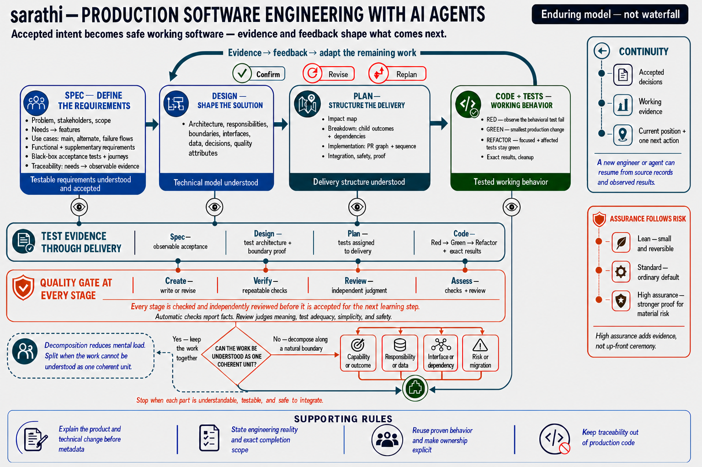

# sarathi — Production Software Engineering with AI Agents

A disciplined, adaptive workflow for building production software with AI coding agents.

sarathi helps AI coding agents and software teams turn accepted intent into the smallest safe
working increment, preserves the decisions and evidence needed to review it, decomposes work
that is too complex to reason about safely as one unit, and adapts the remaining work from
real feedback.

## Why sarathi?

In the Mahabharata, Krishna serves as Arjuna's *sarathi*—his charioteer and counsel. He does
not replace Arjuna's agency; he helps him see the situation clearly, reason through doubt,
and act with purpose. sarathi takes its name from that partnership: it helps engineers and
AI agents navigate complex software decisions and reach production with evidence,
discipline, and human judgment intact.

Its enduring delivery loop is:

```text
accepted intent -> smallest safe increment -> working behavior -> evidence -> feedback -> adapt
```



Specifications, designs, plans, and code preserve the decisions made along that loop; they
do not form a one-way waterfall. Decompose when the work is too complex to understand and
review safely as one coherent unit. Each stage can be
created, verified, reviewed, or assessed independently. Delivery assurance follows actual
risk; approval policy and the intended work outcome are chosen separately. See
[sarathi's enduring model](docs/enduring-model.md).

## What You Get

- Slash-command prompts for specs, designs, plans, code, verification, review, and
  assessment.
- A native `sarathi` skill for agents that support skills.
- Automatic checkers for specs, designs, plans, and links from requirements to tests.
- A repeatable HTML project-status view showing current work, linked tests, feedback, and
  approvals.
- Installers for Windows, macOS, Linux, and WSL.
- User-scoped installs by default, with project-scoped installs when needed.
- Change history in [CHANGELOG.md](CHANGELOG.md) and release/tagging guidance in
  [docs/release-process.md](docs/release-process.md).

Extra checks for specific risks are listed in
[docs/cross-cutting-concerns.md](docs/cross-cutting-concerns.md). Prompt authors should use
[docs/process-maintenance.md](docs/process-maintenance.md) to keep shared rules from bloating
every stage prompt.

## Quick Install

Install Sarathi for the current user with one command:

```sh
uvx --from sarathi-sdlc sarathi-sdlc install
```

`uvx` runs the installer temporarily; the installed skills and prompts remain available.
Restart or reload your agent tools after installation. A user install skips the separate
project-local `checkers/` copy by default because every installed Sarathi skill already
contains its checkers.

When an update notice appears, review and explicitly approve the reported version before
installing it. Replace `X.Y.Z` with that exact approved version:

```sh
uvx --from sarathi-sdlc==X.Y.Z sarathi-sdlc install
```

Verify `manifest.json` reports the approved version, then restart or reload the agent tools.
Agents must never update Sarathi automatically.

Preview the destinations without writing files:

```sh
uvx --from sarathi-sdlc sarathi-sdlc install --dry-run
```

Add `-v` or `--verbose` to show destinations, per-tool actions, companion-install details,
reload guidance, and informational notes.

Install project-local assets, including a top-level `checkers/` copy, or select tools:

```sh
uvx --from sarathi-sdlc sarathi-sdlc install \
  --target /path/to/product --scope project
uvx --from sarathi-sdlc sarathi-sdlc install --tools codex,claude-code
```

## Keep The Installer CLI

Install `sarathi-sdlc` permanently only when you want its installer, version, and update
commands to remain on your `PATH`:

```sh
uv tool install sarathi-sdlc
sarathi-sdlc install
sarathi-sdlc --version
sarathi-sdlc check-update
```

Alternatively, use `pipx install sarathi-sdlc`. After upgrading the package, rerun
`sarathi-sdlc install` to refresh copied skills and prompts. Installed skills check PyPI at
most once per 24 hours and report newer releases without blocking work or updating
automatically. Set `SARATHI_UPDATE_CHECK=0` to disable that check.

## Install From A Source Checkout

Clone the repository and run from its root when developing or testing an unreleased change.

Preview the install without writing files:

```powershell
.\scripts\install.ps1 -DryRun
```

```sh
scripts/install.sh --dry-run
```

Install for the current user:

```powershell
.\scripts\install.ps1
```

```sh
scripts/install.sh
```

Installers report only the target, selected tools, scope, and completion status by default.
Use `-v` in PowerShell or `-v`/`--verbose` in a shell to show destination paths, per-tool
actions, companion-install details, reload guidance, and informational notes.

Install into a specific project workspace from the checkout instead:

```powershell
.\scripts\install.ps1 -TargetRoot D:\path\to\product -Scope project
```

```sh
scripts/install.sh --target /path/to/product --scope project
```

Install only selected tools:

```powershell
.\scripts\install.ps1 -Tool codex,claude-code
```

```sh
scripts/install.sh --tools codex,claude-code
```

By default, Windows installs also refresh WSL targets when WSL is available, and WSL installs
also refresh Windows targets when `powershell.exe` is available. Use `-NoCrossInstall` or
`--no-cross-install` to stay in the current environment.

## Supported Targets

- **Codex**: installs the `sarathi` skill and direct prompt commands under
  `~/.codex/prompts`. Invoke direct prompts as `/prompts:spec-create`,
  `/prompts:design-create`, etc. after restarting Codex.
- **GitHub Copilot**: installs prompt files for VS Code Copilot Chat and first-class agent
  skills for Copilot CLI/agent surfaces. User scope installs prompts under the VS Code user
  prompt folder and skills under `~/.copilot/skills/sarathi` plus
  `~/.agents/skills/sarathi`. Project scope installs prompts to
  `<project>/.github/prompts` and skills to `<project>/.github/skills/sarathi`
  plus `<project>/.agents/skills/sarathi`. Copilot CLI does not treat prompt
  files as custom built-in slash commands, so the installer also creates direct stage skill
  aliases such as `code-review`, `code-verify`, and `code-assess` under the same skill roots.
- **Claude Code**: installs slash commands and the skill.
- **Gemini CLI**: installs command TOML files.
- **Claude and Pi**: exports prompt packs under `.ai-prompts/` for manual import or use.
- **Checkers**: project-scoped package installs copy `checkers/` into the target workspace.
  Implicit user-scoped package installs skip that separate copy unless `--with-checkers` is
  provided; every installed skill still contains its self-contained checker bundle. Source
  installers retain `-NoCheckers` and `--no-checkers` for explicitly skipping the copy.

Installed skill bundles are self-contained: the installer assembles each `sarathi` skill copy
from the canonical `docs/`, `prompts/`, and `checkers/` sources, plus `SKILL.md` and agent
config. Prompt commands or stage skill aliases are also installed separately where host tools
can expose them directly.

Every dry or real install prints the destination folders before doing work.

If an agent reports that `spec-create`, another stage prompt, or `checkers/check_*.py` are
missing, the installed skill is incomplete or was copied from the wrong folder. A valid
skill install should contain files such as `prompts/spec-create.prompt.md` and
`checkers/check_spec.py` under the same `sarathi` skill directory. Re-run the
installer, or install from this repository's `skills/sarathi` folder after
updating to a version where that source folder is self-contained.

## Commands

The prompt set uses four verbs:

- `create`: write or revise a document or code slice.
- `verify`: run repeatable checks and report what they prove and do not prove.
- `review`: independently judge quality and look for counterexamples.
- `assess`: run `verify` first, then `review`.

The core stage names are:

| Command | Purpose |
| --- | --- |
| `/spec-create` | Define the problem, needs, features, use cases, functional and supplementary requirements, acceptance tests, and journeys. |
| `/spec-verify` | Run automatic spec checks and report evidence. |
| `/spec-review` | Independently review spec quality. |
| `/spec-assess` | Run `/spec-verify` plus `/spec-review`. |
| `/design-create` | Create or revise a Software Design Document and ADRs as needed. |
| `/design-verify` | Run spec and design checks. |
| `/design-review` | Independently review design quality and whether the spec is sufficient. |
| `/design-assess` | Run `/design-verify` plus `/design-review`. |
| `/plan-create` | Create a Breakdown or Implementation plan with an Impact Map, dependency graph, sequence, integration, safety, and proof. |
| `/plan-verify` | Run checks for the spec, design, and plan. |
| `/plan-review` | Independently review plan readiness, slicing, assignment, and sequencing. |
| `/plan-assess` | Run `/plan-verify` plus `/plan-review`. |
| `/code-create` | Implement an approved plan with focused tests and any planned logging, error-handling, documentation, build, or deployment work. |
| `/code-verify` | Run planned tests, required project checks, and applicable logging/error-handling/build/docs/deployment checks. |
| `/code-review` | Independently review code, tests, operational work, required project checks, and consistency with earlier documents. |
| `/code-assess` | Run `/code-verify` plus `/code-review`. |
| `/workflow-status` | Render project status as read-only HTML. |

Generate the live status page and its linked static process guide directly with:

```pwsh
python checkers/render_workflow_status.py . --output docs/sdlc-status.html
```

See [docs/workflow-status.md](docs/workflow-status.md) for discovery rules, evidence
semantics, deterministic output, guide publication, and CI freshness checks.
The page leads with engineering state—what works, what is reusable, what remains shared or
target-owned, what is deferred, coding blockers, and one next action—before showing document,
approval, and review state. Completion claims always name their exact scope.

Exact invocation syntax depends on the host tool:

- Codex direct prompts: `/prompts:code-review`, `/prompts:code-assess`, and so on.
- GitHub Copilot CLI: stage names are installed as skill aliases where supported, so try
  `/code-review` or `/code-assess` after `/skills reload`. If the CLI surface rejects a
  stage slash name, invoke by natural language: "Use the sarathi skill to run the
  code-review stage."
- VS Code Copilot Chat: use the installed prompt file from the prompt picker, or ask in
  natural language with the stage name.
- Claude Code and Gemini: use their native command mechanisms.

## Workflow Model

The core model is [accepted intent, the smallest safe increment, evidence, feedback, and
adaptation](docs/enduring-model.md). Specifications use a
[needs-to-evidence requirements model](docs/requirements-model.md): problems and stakeholder
needs lead to features, use cases, functional and supplementary requirements, acceptance
tests, and journeys. Designs turn accepted requirements and constraints into an
implementable, evolvable technical model. Plans structure delivery through impact analysis,
breakdown or a PR dependency graph, sequencing, integration, safety, and proof. Code plus
tests produce working behavior through short Red-Green-Refactor cycles. Repeatable checks
and independent review gate every stage; they are not deferred until implementation ends.

Work uses three levels. The paired terms below are retained as machine-readable values for
compatibility:

- **Product/system**: broad product or platform scope.
- **Feature/component**: one user-facing capability, subsystem, component, integration, or
  screen family.
- **Slice/change**: the smallest implementable unit, usually PR-sized.

Documents say plainly whether the work is ready to implement and, when it is not, what
specific question remains.

`/code-create` runs from approved requirements and a specific implementation plan that is
ready to implement.

Start implementation when the approved requirements, design, and one specific plan make the
next change clear and safe. If the work is too complex to understand and review as one
unit, split it along a natural product or technical boundary until each part is clear,
testable, and safe to integrate. A split does not automatically require another spec or
design. See
[docs/work-decomposition.md](docs/work-decomposition.md).

## ID Format

Specs and plans use descriptive slug-only IDs: `KIND-AREA-NAME`, for example
`FR-AUTH-SIGNIN`, `AT-AUTH-SIGNIN`, `JT-AUTH-ONBOARDING`, `PR-AUTH-SIGNIN`, and
`WAVE-AUTH-BOUNDARY`. Design
entities keep the shorter `KIND-SLUG` form, for example `COMP-AUTH` and `IFACE-AUTH`.
Design test obligations use `TEST-AREA-NAME`, for example `TEST-AUTH-POLICY`. Numeric
suffixes such as `FR-AUTH-10` are rejected by the checkers.

For older numbered IDs, see [docs/slug-id-migration.md](docs/slug-id-migration.md).

## Builds And Deployment

Builds and deployment are covered from the beginning:

- Specs capture externally relevant build, release, deployment, rollout, rollback,
  migration, smoke-check, and operational acceptance needs.
- Designs define deployable outputs, build/package strategy, release workflow,
  environments, configuration/secrets, promotion, deployment topology, validation, and
  ownership.
- Plans assign build scripts, package manifests, generated outputs, CI/CD config, IaC or
  deployment manifests, migration scripts, smoke checks, rollback checks, and release docs
  to child work or PRs.
- Code creates and verifies the planned build/deployment pieces. It should run the build,
  verify the expected build output, validate deployment scripts/manifests with dry-run or lint
  checks where possible, and avoid live production deployment unless explicitly requested.

Reviews stop when build or deployment intent is missing from the earlier document that
should own it.

## Test Environments

The process treats test environments as design and planning decisions:

- Specs capture externally relevant environment needs or non-goals when they affect
  acceptance, release safety, data, integrations, or operations.
- Designs always define the developer test environment and recommend additional
  environments when context warrants them: shared integration/test, staging or
  pre-production, production canary/smoke, and synthetic monitoring.
- Plans assign setup, data/secrets handling, reset/cleanup, deployment validation, smoke/
  canary/rollback checks, and ownership for each planned environment.
- Code runs the planned environment checks. Live production checks require explicit user
  approval.

Not every product needs every environment. The design should explain which environments are
required now, recommended later, deliberately deferred, or unnecessary, including residual
risk.

## Context-Driven Reviews And Tests

At every phase, agents should ask what the context implies beyond the user's first words.
Depending on the domain, data, users, integrations, platform, and deployment risk, the
process may need dedicated performance/load tests, security review or threat modeling,
privacy/compliance review, accessibility audit, resilience or disaster-recovery checks,
backup/restore rehearsal, migration rehearsal, localization review, abuse/fraud/safety
review, cost guardrails, compatibility tests, or operational reviews.

Specs capture these as requirements, acceptance criteria, non-goals, assumptions, or open
questions. Designs turn them into tactics, `TEST-` obligations, ADRs, or risks. Plans assign
them to work items or PRs. Code runs the planned checks and stops to revise earlier documents
if implementation reveals a material concern that was not planned.

## User And Developer Documentation

Documentation is also covered from the beginning:

- Specs capture user and developer documentation audiences, tasks, onboarding, help,
  API/reference, examples, runbooks, troubleshooting, release notes, accessibility, and
  acceptance needs.
- Designs define the documentation architecture: source locations, generated vs. written
  docs, API/reference generation, examples, diagrams, publishing/versioning, ownership, and
  validation checks.
- Plans assign documentation work to PRs, including user guides, README/API docs, examples,
  runbooks, troubleshooting, migration notes, release notes, generated docs, and link/doc
  checks.
- Code updates and verifies the planned docs with the implementation. Public docs should
  match actual behavior and contracts, not describe unimplemented future behavior.

Reviews stop when documentation intent is missing from the earlier document
that should own it.

## Logging, Telemetry, And Error Handling

Diagnostics and failure behavior are covered across the lifecycle:

- Specs capture externally relevant human/agent/operator diagnostics, telemetry,
  application performance monitoring, support/debugging needs, privacy/redaction
  constraints, user-facing error behavior, and boundary error contracts as requirements or
  non-goals.
- Designs define structured logging, correlation IDs, events, metrics, traces, sinks,
  APM instrumentation, service/resource names, latency/throughput/error/saturation metrics,
  dashboards, SLO/SLI signals, exporter/provider choices such as OpenTelemetry or New Relic,
  retention/redaction, alert hooks, and how UI/API/domain/infrastructure errors are mapped,
  recovered, retried, degraded, or surfaced.
- Plans assign logging, telemetry, and error-handling work to PRs, including fixtures,
  APM setup, dashboards/alerts, pass/fail checks, and tests for representative success/
  failure paths.
- Code implements and verifies the planned diagnostics and error handling without leaking
  secrets, stack traces, raw objects, or unstable internals to users, logs, APM providers,
  or agents.

Reviews stop when logging, telemetry, or error-handling intent is missing from the earlier
document that should own it.

## Delivery Decisions

At project entry and for the first requirements of a feature, choose and record three
independent decisions: a delivery assurance profile, approval policy, and work outcome.
Lean suits small reversible work, Standard is the ordinary default or choice when risk is
unclear, and High-assurance adds proof for material security, privacy, safety, regulatory,
financial, availability, migration, or irreversible-data risk. Approval policy is either
human checkpoints or automatic approval for locally eligible gates; YOLO and unattended
language never choose automatic approval. Work is either a product increment or a
decision/evidence result. Add only checks relevant to the actual risk; none of these choices
bypasses tests, feedback, safety limits, or protected approval gates. See
[delivery assurance profiles](docs/assurance-profiles.md),
[approval gates](docs/approval-gates.md), and [project entry](docs/project-entry.md).

## General Cleanup

Agents run a focused cleanup at suitable handoff points, and always before ending a code
change, to remove odd issues such as tautological tests, mock-only confidence,
stale requirement-to-test links, superficial security work, debug leftovers, and misleading docs.
Cleanup stays inside the current scope; larger discoveries become follow-up findings or
revisions to earlier documents.

## Simplify Pass

After cleanup when both apply, and before handoff for specs, designs, plans, and code
changes, agents simplify the work. This removes over-engineered requirements, layers,
abstractions, extension points, fixtures, checks, or code paths that are not justified by
accepted scope, risk, constraints, or evidence. Necessary detail, reviewability,
requirement links, and real boundaries stay intact; larger simplifications require changes
to the controlling documents.

Process links must not become product architecture. Work in an existing system reuses its
compatibility suites by default, and generalization normally waits for a second concrete
consumer. If the solution is larger than the problem requires, simplify it. See
[docs/simplicity-first.md](docs/simplicity-first.md).

## Feedback

Specs, designs, and plans record the current agreed requirements and decisions; approval
does not freeze them. After each change, record real feedback and update earlier documents
when the result changes what should happen next.

Parallel work is safe only when one result cannot invalidate another, file ownership is
clear, and someone owns integration and review. See
[docs/feedback-and-learning.md](docs/feedback-and-learning.md).

## Human-first documents

New and materially revised specs, designs, and plans lead with a plain-language Product
Overview, Technical Approach, or Implementation Approach. Visible headings describe the product and architecture;
stable process IDs live in structured comments and a final traceability appendix. Legacy
documents remain parseable until materially revised. Production and test source stays free
of Sarathi IDs added merely for traceability. See
[Human-first documents](docs/human-first-artifacts.md).

Plans also inspect the existing system and sibling services before describing work. Each
delivery item says whether it reuses existing code, extracts then reuses it, remains
target-owned, adds genuinely new behavior, or defers non-blocking cleanup.

## Approval Policy And YOLO Mode

Human checkpoints are the default approval policy. Under it, important transitions require
human review:

- If important input is missing, the agent asks one focused question at a time.
- After a document or code slice is generated, materially revised, reviewed, or assessed, the agent stops
  for human review.
- For UI-facing products, `/spec-create` asks whether a mock UI is required. If the spec
  records `UI Mock Preference: Required`, the mock UI requires explicit approval:
  later planning, code, and production UI work must wait for explicit user approval of
  the mock.
- Reviews stop when they discover issues in an earlier spec, design, or plan.

With human checkpoints, a completed spec does not automatically flow into design; a completed
design does not automatically flow into planning; a completed plan does not automatically
flow into code; and an assessed code slice does not automatically flow into the next
learning-dependent slice or release/deployment work until its feedback status and
parent-document check are visible. The agent should end its turn with document paths,
readiness/status, verification/review/assessment results, open questions, and the recommended
next command.

An explicit `automatic_eligible_gates` policy may cross only gates enabled by local
`.sdlc/gates.yaml` and only during explicitly requested end-to-end continuation. It never
crosses release or production deployment, security or privacy acceptance, required UI
approval, locally excluded gates, or a stop caused by missing evidence, failed checks, or a
learning dependency.

You can opt into **YOLO mode** with phrases like:

```text
yolo
use your judgment
make reasonable assumptions
proceed without questions
```

YOLO mode lets the agent make reasonable assumptions and continue, but it must record those
assumptions, risks, and trade-offs. YOLO does not select automatic approval or bypass
readiness checks, expected file changes, required tests, safety constraints, or protected
approval gates. End-to-end continuation additionally needs the recorded automatic policy and
an eligible local gate.

## Approval Records

Projects can make approvals automatically checkable with local YAML files:

- `.sdlc/approvals.yaml` records local approvals, approvers, UTC timestamps, and
  SHA-256 hashes.
- `.sdlc/gates.yaml` optionally enables limited auto-approval for low-risk modes such as
  internal prototypes.

Checkers support `--require-approvals` for later gate runs. The approval is valid only when
the entry matches the gate, document path, status, UTC `approved_at`, and current file hash.
Stale hashes fail. No ticketing system is required. This proves structure and
freshness of a local record, not human identity, intent, or external consent; reports must
show whether a gate was approved by a named user or by local auto-approval policy.
Approval is permission for the next learning step, not proof that a document is final,
correct, or informed by end-user feedback. Feedback source and status are recorded
separately.

See [docs/approval-gates.md](docs/approval-gates.md).

## Tests And Verification

Test responsibility is split by document and code stage:

- Specs define `AT-` acceptance criteria at product/system, feature/component, and
  slice/change scope; the criteria become narrower as the scope narrows. Specs also define
  `JT-` journey tests for long ordered stories that compose multiple `AT-` scenarios.
- Designs define the test architecture and explicit `TEST-<AREA>-<NAME>` executable test
  obligations for unit, component, contract, integration, UI, journey/e2e, quality,
  docs/build/deploy, migration, and operational checks.
- Designs also define the test environment strategy: developer environment always, plus
  shared integration/test, staging/pre-production, production canary/smoke, and synthetic
  monitoring when context warrants them.
- External systems should be tested against the real dependency or its official conformance
  surface whenever feasible. If a mock, fake, stub, local mirror, or locally re-declared
  interface replaces the real system, the documents must flag that as a risk and
  name the mitigation: real-boundary smoke/integration test, official conformance harness,
  type-conformance check, generated schema/client, vendor sandbox/emulator, captured real
  fixture, or explicit user-approved limitation. A primary integration seam should not be
  covered only by a self-authored double.
- Plans assign `AT-` acceptance coverage, `JT-` journey coverage, and `TEST-` obligations
  to PRs.
- Behavior-changing code follows Red-Green-Refactor: run the smallest meaningful behavioral
  test and observe the expected failure, implement the minimum change that passes it, then
  improve the code while the focused test and affected suite remain green. A test written
  only after implementation is regression coverage, not evidence of test-first development.
  When a failing automated test is not a sensible driver, use only the narrow cases and
  replacement verification in [test ownership](docs/test-ownership.md).
- Code writes the executable tests and implementation. This is where unit, component,
  contract, integration, UI, journey/e2e, quality, migration, build/deploy, docs, and
  operational test implementations are created when planned. A project may maintain a
  requirement-to-test inventory when its audit or assurance needs justify it; reviewers
  still inspect tests and their pass/fail checks.
- Code may also add implementation-local supplemental tests, such as helper, pure-core,
  parser, mapper, regression, characterization, table/property, adapter, or edge-case
  tests. These supplement, never replace, planned `AT-`/`JT-`/`TEST-` coverage; they stay
  within the current `PR-` and expected files and use a clear pass/fail check.
  If they imply new externally visible behavior, contract, UX/NFR, or scope, revise the
  controlling document first.
- Test implementations are reviewed as code in `/code-review` and `/code-assess`: assertions,
  fixtures, helpers, mocks, data, selectors, determinism, readability, maintainability, and
  false-positive/false-negative risk are judged, not just whether the tests pass.
- Every executable test needs a clear pass/fail result: return value, state, persisted
  record, event, API response, DOM/accessibility output, screenshot/visual baseline,
  generated file, structured log, metric, trace, deployment signal, or captured external call as
  appropriate.
- Defect remediation updates earlier documents first when the defect reveals missing UX
  quality, unclear boundary contracts, missing logging/telemetry/error-handling intent,
  unrealistic mocks, or other latent spec/design/plan gaps.
- Documentation, logging/telemetry, error-handling, build, and deployment checks are
  assigned through the same spec/design/plan chain and verified during code creation,
  `/code-verify`, or `/code-assess` when planned. The same is true for environment-specific
  checks and context-driven reviews/tests such as performance, security, privacy,
  accessibility, resilience, migration, compatibility, cost, and operational checks.
  Production-facing telemetry should include APM/application-performance signals when
  warranted: latency, throughput, error rate, saturation/resource use, critical spans, trace
  propagation, dashboards, alerts, and SLO/SLI signals.

Use `/code-verify` when you simply want a confidence run after a change: planned tests,
pre-commit/equivalent gates, logging/error-handling checks, build checks,
documentation checks, deployment dry-runs or smoke checks where planned, and `check_code.py`.
Use `/code-review` when you want independent judgment. Use `/code-assess` when you want both
in one gate.

The checkers provide repeatable evidence about required structure and links:

```powershell
python checkers/check_spec.py spec.md --json
python checkers/check_design.py design.md --json
python checkers/check_plan.py plan.md --spec spec.md --design design.md --json
python checkers/check_code.py --plan plan.md --tests-argv '["pytest","-q"]' --json
```

If `python` is unavailable, try `python3`, then `uv run python`.

Coverage targets and requirement-to-test inventories are project-level controls, not Sarathi
defaults. When a project adopts them, document the purpose and owner in that project and
review the resulting evidence; neither a percentage nor a mapping proves meaningful tests.
Reviewability is judged by cohesive purpose, conceptual complexity, touch scope, evidence,
and rollback. Sarathi does not impose source-file, module, diff, or PR line-count targets.
TODO/FIXME/XXX/skip/xfail markers are surfaced with file, line, marker, and text. Do not
add SDLC-specific annotations to app code. These markers are review warnings rather than
automatic failures. Review treats unexplained skips and expected failures as evidence gaps,
while an environment-specific skip may be supported by an explicit passing command or CI
job for that boundary.

The checkers do not prove that the work is correct. Assessment commands pair check results
with independent review of requirements, design, plan quality, test implementation quality,
pass/fail rigor, whether the implementation is suitable, logging/error-handling,
documentation/build/deployment
completeness, and consistency across stages.

## Repository Layout

```text
docs/      user-facing documentation and review notes
prompts/   source stage prompt definitions
skills/    skill-specific definitions and metadata
checkers/  repeatable structure and link checks
scripts/   installers for Windows, macOS, Linux, and WSL
tests/     checker tests
```

Do not treat `.github/prompts` as source in this repository. It is only an install target
for GitHub Copilot project-scoped prompts.

## More Detail

- Changelog: [CHANGELOG.md](CHANGELOG.md)
- Release process: [docs/release-process.md](docs/release-process.md)
- Static process guide and example tree: [docs/sarathi.html](docs/sarathi.html)
- Cross-scope test and integration ownership: [docs/test-ownership.md](docs/test-ownership.md)
- Review checklist: [docs/review-verification-checklist.md](docs/review-verification-checklist.md)
- Slug ID migration: [docs/slug-id-migration.md](docs/slug-id-migration.md)
- Approval gates: [docs/approval-gates.md](docs/approval-gates.md)
- Agent-facing repository guidance: [AGENTS.md](AGENTS.md)
